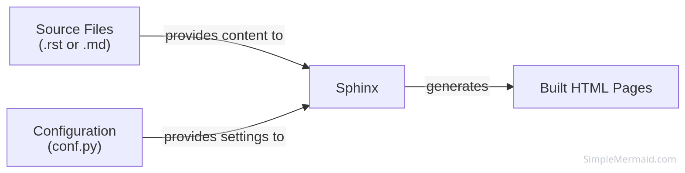
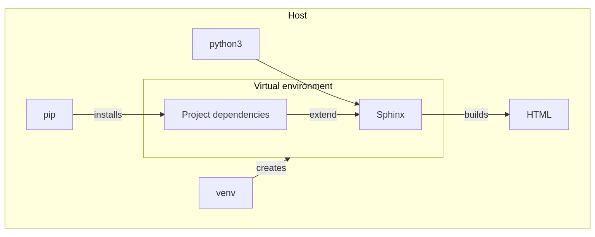
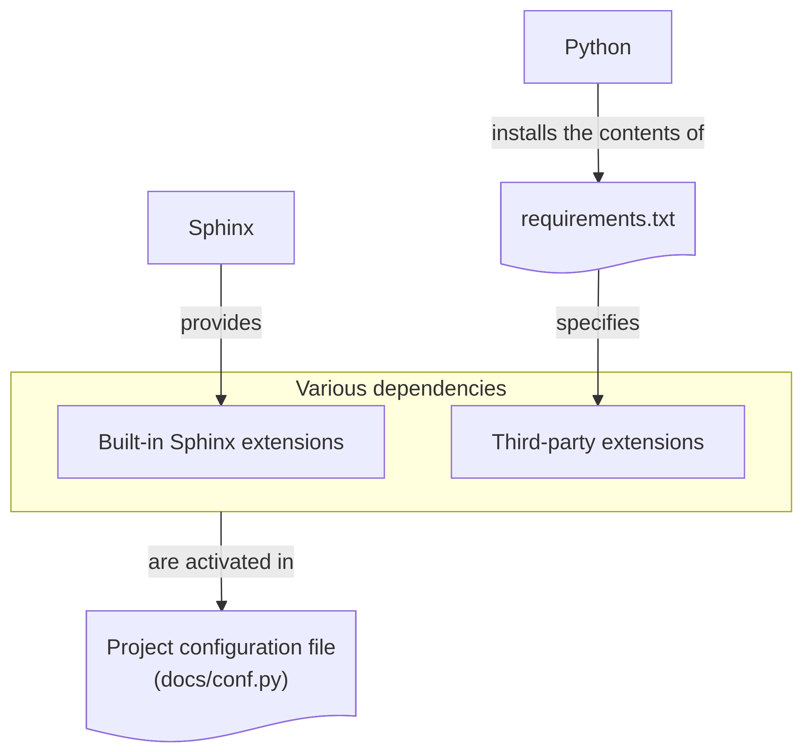
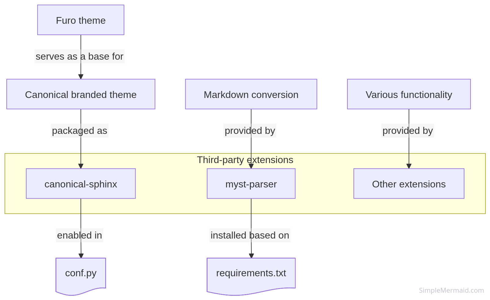
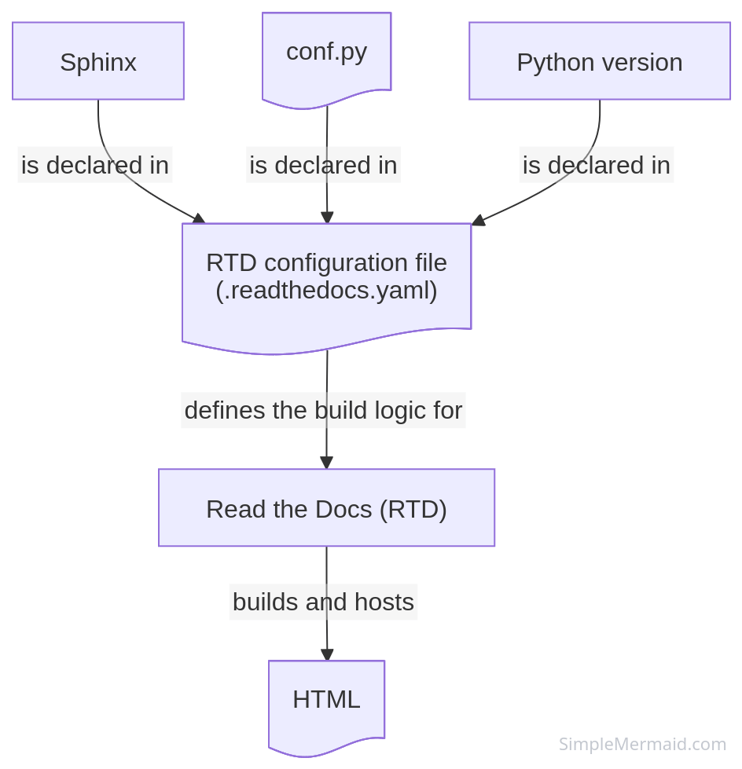

.. meta::
    :description: A breakdown of the constituent elements of the Sphinx Stack.

.. _explanation-structure:

Sphinx Stack structure
======================

The Sphinx Stack is a template `Sphinx <https://www.sphinx-doc.org/en/master/>`__
project. It provides a default file structure, a theme, and dependencies for Canonical
documentation.

Sphinx
------

Sphinx is a documentation static site generator that converts reStructuredText or
Markdown files into HTML. It's the core software in the Sphinx Stack.

The ``docs/conf.py`` file is a configuration file that defines the properties of the
Sphinx project such as project metadata and extensions.
 

    Sphinx as a documentation static site generator

Python
------

Because Sphinx is a Python application, the Sphinx Stack depends on Python and a Python
package manager. Most of its dependencies are Python packages. Local builds of the
Sphinx Stack require a Python virtual environment to isolate the project from the host
system.

To be able to work on a Sphinx Stack project, your host needs Python 3.11, pip, and
venv.

    Python's role in the Sphinx Stack

Sphinx extensions
-----------------

The syntax and behavior of Sphinx can be modified with extensions. These can be used to
create diagrams, test code, and more.

The Sphinx Stack includes a curated and tested set of extensions.

    Extension types
        

Built-in extensions
~~~~~~~~~~~~~~~~~~~

Built-in extensions do not need to be installed separately from Sphinx and can be
enabled through the configuration file. The ``conf.py`` file has already been configured
to enabled typical extensions necessary for documentation work.

Third-party extensions
~~~~~~~~~~~~~~~~~~~~~~

If an extension is not built into Sphinx, you must include it in the
``requirements.txt`` file before enabling it in the Sphinx configuration file.

Extensions are Python packages, and the Sphinx Stack manages them with a
`requirements.txt <https://pip.pypa.io/en/stable/reference/requirements-file-format/>`__
file.  

    Third-party extensions

Markdown support
^^^^^^^^^^^^^^^^

By default, Sphinx uses reStructuredText. Markdown is supported through the `MyST parser
<https://myst-parser.readthedocs.io/en/latest/>`_, which is enabled with the
``myst-parser`` extension.

Canonical theme
^^^^^^^^^^^^^^^

The Canonical theme is packaged as a standalone `canonical-sphinx
<https://github.com/canonical/canonical-sphinx>`_) extension. It is based on `Furo
<https://github.com/pradyunsg/furo>`__ and is designed to follow Canonical branding.

Command-line tools
------------------

The Sphinx Stack uses Make as its local build system. The Makefile in the Sphinx Stack
provides a command-line interface for setting up the virtual environment, installing
dependencies, building the documentation, and more.

Makefile
~~~~~~~~

Some of the Makefile targets (such as ``html`` and ``linkcheck``) provide Sphinx-native
functionality for building documentation or performing tests in a simplified form while
managing required dependencies. For example, instead of using  the ``sphinx-build
linkcheck SOURCEDIR OUTPUTDIR`` command, you can use ``make linkcheck``. 

See :ref:`build` to learn how the local build process works.  

Additionally, the Makefile provides commands to trigger third-party CLI tools, such as
the Vale prose linter for :ref:`Style guide linting <style_guide_linting>`.

Read The Docs configuration file
--------------------------------

Read The Docs is a documentation building and hosting platform. It takes the
documentation created using Sphinx (or other tools) and builds and publishes it online.

If you are publishing your documentation through Read the Docs, the Read the Docs build
logic is declared in ``.readthedocs.yaml``. The Sphinx Stack comes with a pre-configured
``.readthedocs.yaml`` with default values that should work for the majority of projects.

See :ref:`publish-on-rtd` to learn how configure your Read the Docs instance.  

    Read the Docs build configuration

